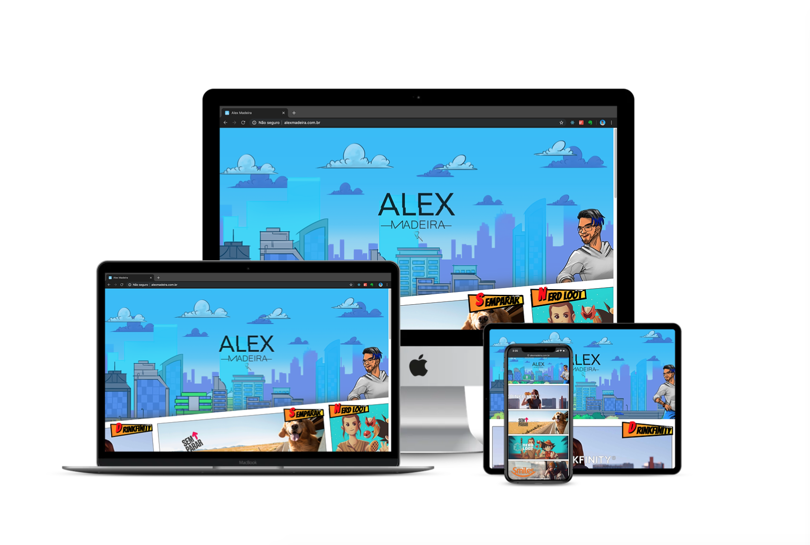

# Alex Madeira (Mark VIII) [](https://app.netlify.com/sites/upbeat-lichterman-44a778/deploys)

Meu portfólio, até eu resolver mudar ele de novo.

## Preview

[](https://www.alexmadeira.com.br)

## Começando

Estas instruções fornecerão uma cópia do projeto em execução na sua máquina local para fins de testes, ou não.

### Pré-requisitos

O que você precisa para iniciar o projeto

```
npm  ou yarn
```

### Instalando

```
1. git clone git@bitbucket.org:alexmadeira5/mark-viii.git
2. cd mark-viii/
3. yarn ou npm install
4. yarn start ou npm run start
```

O projeto vai abrir altomaticamente em [http://localhost:3000/](http://localhost:3000/ 'http://localhost:3000/')

## Padronização de código

no projeto utilozo

```
1. Prettierrc
2. Editorconfig
3. Eslint
```

Seguindo a style guide do [Airbnb](https://github.com/airbnb/javascript 'Airbnb').

### Deploy

- Utilizo a ferramenta [buddy](https://buddy.works/ 'buddy'), para controlar os pipelines e a CI do Back-end
- Utilizo a plataforma [netlify]("https://www.netlify.com/"), para servir os arquivos estáticos (Font-end)

## Autor

- **Alex Madeira** - [Bitbucket](https://bitbucket.org/alexmadeira5/)

## Licença

Copyright by [Alex Madeira](https://alexmadeira.com.br/).

Sinta-se a vontade para olhar baixar copiar não tem problema :)

MIT license.
